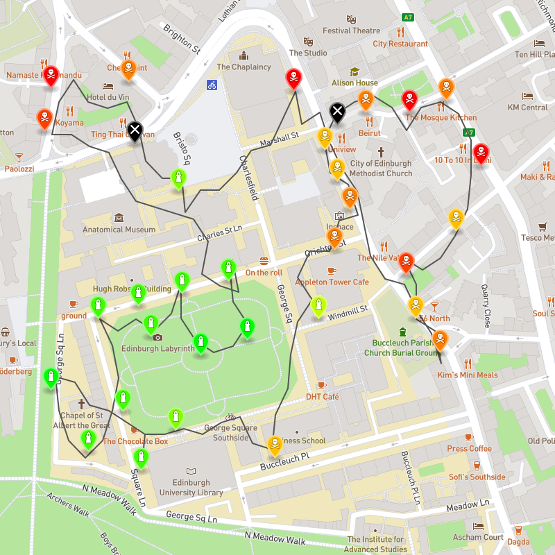

# Air Quality Maps
## Informatics Large Practical 2020

My submission for the ILP course at the University of Edinburgh in December 2020.

It achieved a mark of **88%**.

The task involved building a program that can take in a list of locations of air quality sensors, and creating a route plan for a drone to visit each of these sensors and take readings.
More information is available in the [specification document](readme-assets/ilp-coursework-v1.0.2.pdf).

My written report is available to view [here](readme-assets/ilp-report.pdf).

An example of a route produced by my program:

